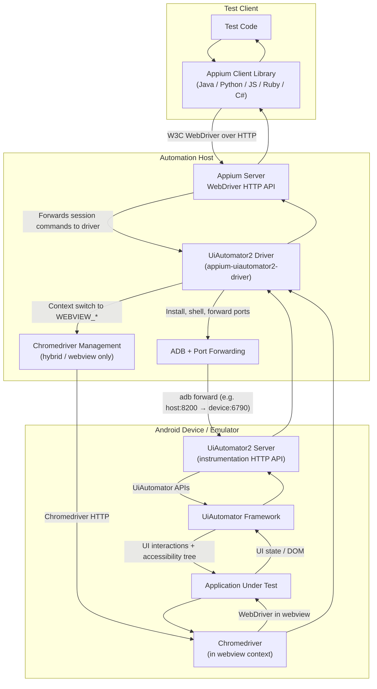

# Architecture

```mermaid
flowchart TD
  subgraph ClientSide["Test Client"]
    T["Test Code"]
    CL["Appium Client Library<br/>(Java / Python / JS / Ruby / C#)"]
  end

  subgraph ServerHost["Automation Host"]
    AS["Appium Server<br/>WebDriver HTTP API"]
    XD["UiAutomator2 Driver<br/>(appium-uiautomator2-driver)"]
    ADBM["ADB + Port Forwarding"]
    CDM["Chromedriver Management<br/>(hybrid / webview only)"]
  end

  subgraph DeviceTarget["Android Device / Emulator"]
    U2S["UiAutomator2 Server<br/>(instrumentation HTTP API)"]
    UIA["UiAutomator Framework"]
    CD["Chromedriver<br/>(in webview context)"]
    AUT["Application Under Test"]
  end

  T --> CL
  CL -->|"W3C WebDriver over HTTP"| AS
  AS -->|"Forwards session commands to driver"| XD
  XD -->|"Install, shell, forward ports"| ADBM
  XD -->|"Context switch to WEBVIEW_*"| CDM
  ADBM -->|"adb forward (e.g. host:8200 → device:6790)"| U2S
  CDM -->|"Chromedriver HTTP"| CD
  U2S -->|"UiAutomator APIs"| UIA
  UIA -->|"UI interactions + accessibility tree"| AUT
  CD -->|"WebDriver in webview"| AUT

  AUT -->|"UI state / DOM"| UIA
  AUT --> CD
  UIA --> U2S
  U2S --> XD
  CD --> XD
  XD --> AS
  AS --> CL
  CL --> T
```
