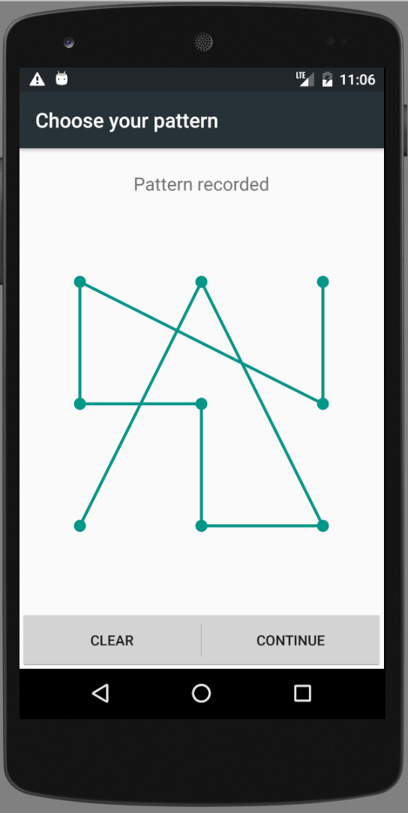
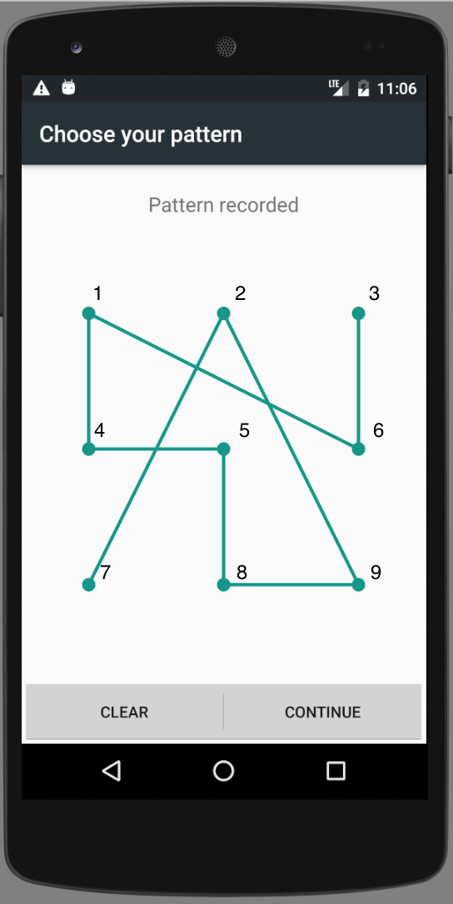

# Unlock

UiAutomator2 driver allows dealing with the Android lock screen using various APIs.
This article describes available APIs and their options.

## Unlock On Session Startup

UiAutomator2 provides the following [capabilities](../../README.md#device-locking) to deal
with the system lock screen:

- appium:unlockStrategy
- appium:unlockSuccessTimeout
- appium:skipUnlock
- appium:unlockType
- appium:unlockKey

These capabilities could be used to unlock the device under test during the driver session initialization
as well as deal with different lock screen types.

### appium:unlockStrategy

Either `locksettings` (default since Android 8/API level 26) or `uiautomator` (legacy).

The `locksettings` strategy uses `adb shell locksettings` CLI to deal with different
types of device lock screens. It is fast, reliable, but has one downside: the actual
pin, pattern or password must be temporarily removed in order to unlock the device and restored afterwards.

Setting the strategy to `uiautomator` will enforce the driver to use UiAutomator framework in order
to interact with the device's lock screen for various unlock types. It might be slower and less stable in comparison
to the `locksettings` strategy, although there is no other alternative if tests are being executed on an older Android version
or the application under test requires the device to constantly maintain display lock settings.

### appium:unlockSuccessTimeout

Maximum number of milliseconds to wait until the device is unlocked. `2000` ms by default

### appium:skipUnlock

The `appium:skipUnlock` capability is enabled by default and makes the driver to detect and handle the lock screen
upon session startup _if it is present_. If the lock screen cannot be detected upon session startup then nothing will be
done. By default, it is assumed the device has a "simple" lock screen, which could be removed by waking up the device.
In case the device has a different type of the lock screen configured in its settings then the information about it
must be provided in the below capability values.

### appium:unlockType and appium:unlockKey

This capability supports the following possible values:

#### pin

Assumes the device is protected with a PIN code. Expects the `appium:unlockKey` to contain a valid pin consisting
of digits in range 0-9, for example `1111`.

#### pinWithKeyEvent

Same as [pin](#pin), but uses ADB instead of UiAutomator framework to enter the actual pin value.

#### password

Assumes the device is protected with a password. Expects the `appium:unlockKey` to contain a valid password consisting
of latin characters, for example `abcd1234`.

#### pattern

Assumes the device is protected with a secret pattern. Check the example below for more details on the `appium:unlockKey`
value for this particular unlock type.

##### Example

Let say you have a device that is locked with a pattern similar to the one on the image below,
and you want to run a test over that device.



We treat the pattern pins similarly to numbers on a digital phone dial. So, in this case the *unlockKey* is `729854163`



and capabilities are:

```json
{
  "appium:unlockType": "pattern",
  "appium:unlockKey": "729854163"
}
```

## Mid-Session Unlock

There is also a possibility to interact with the device's lock screen while the test session is running.
Use the following mobile extensions for this purpose:

- [mobile: lock](../../README.md#mobile-lock)
- [mobile: unlock](../../README.md#mobile-unlock)
- [mobile: isLocked](../../README.md#mobile-islocked)
